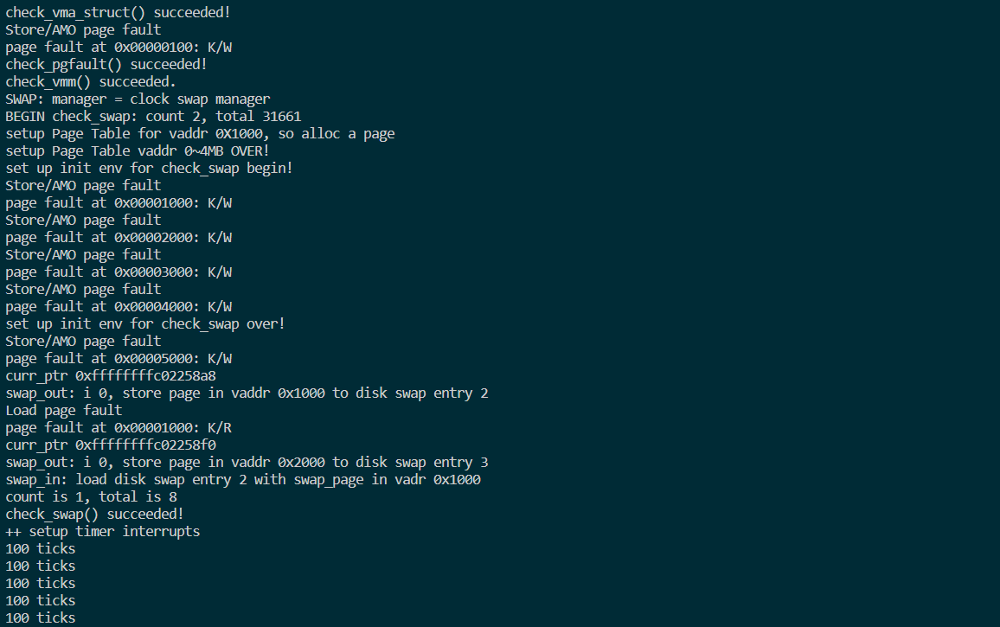
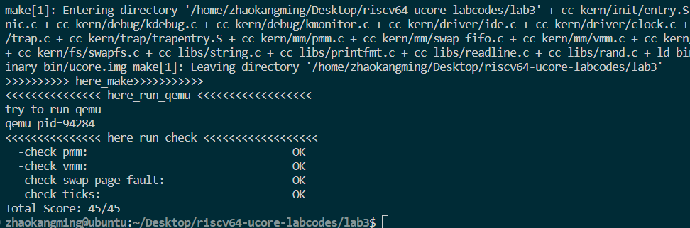

# Lab3实验报告

## 练习

对实验报告的要求：
 - 基于markdown格式来完成，以文本方式为主
 - 填写各个基本练习中要求完成的报告内容
 - 完成实验后，请分析ucore_lab中提供的参考答案，并请在实验报告中说明你的实现与参考答案的区别
 - 列出你认为本实验中重要的知识点，以及与对应的OS原理中的知识点，并简要说明你对二者的含义，关系，差异等方面的理解（也可能出现实验中的知识点没有对应的原理知识点）
 - 列出你认为OS原理中很重要，但在实验中没有对应上的知识点
 
## 练习0：填写已有实验
本实验依赖实验1/2。请把你做的实验1/2的代码填入本实验中代码中有“LAB1”,“LAB2”的注释相应部分。

## 练习1：理解基于FIFO的页面替换算法（思考题）
描述FIFO页面置换算法下，一个页面从被换入到被换出的过程中，会经过代码里哪些函数/宏的处理（或者说，需要调用哪些函数/宏），并用简单的一两句话描述每个函数在过程中做了什么？（为了方便同学们完成练习，所以实际上我们的项目代码和实验指导的还是略有不同，例如我们将FIFO页面置换算法头文件的大部分代码放在了`kern/mm/swap_fifo.c`文件中，这点请同学们注意）
 - 至少正确指出10个不同的函数分别做了什么？如果少于10个将酌情给分。我们认为只要函数原型不同，就算两个不同的函数。要求指出对执行过程有实际影响,删去后会导致输出结果不同的函数（例如assert）而不是cprintf这样的函数。如果你选择的函数不能完整地体现”从换入到换出“的过程，比如10个函数都是页面换入的时候调用的，或者解释功能的时候只解释了这10个函数在页面换入时的功能，那么也会扣除一定的分数

## 练习2：深入理解不同分页模式的工作原理（思考题）
get_pte()函数（位于`kern/mm/pmm.c`）用于在页表中查找或创建页表项，从而实现对指定线性地址对应的物理页的访问和映射操作。这在操作系统中的分页机制下，是实现虚拟内存与物理内存之间映射关系非常重要的内容。
- get_pte()函数中有两段形式类似的代码， 结合sv32，sv39，sv48的异同，解释这两段代码为什么如此相像。
- 目前get_pte()函数将页表项的查找和页表项的分配合并在一个函数里，你认为这种写法好吗？有没有必要把两个功能拆开？

### 2.1get_pte()函数中有两段形式类似的代码， 结合sv32，sv39，sv48的异同，解释这两段代码为什么如此相像。

 两段相似的代码如下：
 ```c
    pde_t *pdep1 = &pgdir[PDX1(la)];
    if (!(*pdep1 & PTE_V)) {
        struct Page *page;
        if (!create || (page = alloc_page()) == NULL) {
            return NULL;
        }
        set_page_ref(page, 1);
        uintptr_t pa = page2pa(page);
        memset(KADDR(pa), 0, PGSIZE);
        *pdep1 = pte_create(page2ppn(page), PTE_U | PTE_V);
    }
```
```c
    pde_t *pdep0 = &((pde_t *)KADDR(PDE_ADDR(*pdep1)))[PDX0(la)];
    if (!(*pdep0 & PTE_V)) {
        struct Page *page;
        if (!create || (page = alloc_page()) == NULL) {
            return NULL;
        }
        set_page_ref(page, 1);
        uintptr_t pa = page2pa(page);
        memset(KADDR(pa), 0, PGSIZE);
        *pdep0 = pte_create(page2ppn(page), PTE_U | PTE_V);
    }
```

这两段代码都是用于获取虚拟地址对应的页表项（Page Table Entry, PTE），其中第一段代码用于获取第一级页表项（PDE1），第二段代码用于获取第二级页表项（PDE0）。

sv32、sv39和sv48是RISC-V架构中定义的三种不同的页表格式，用于管理虚拟内存和物理内存之间的映射关系。这些页表格式的主要区别在于页表项的位数和结构。在sv32中，虚拟地址32位，采用两级页表结构，第一级页表项占用10位，第二级页表项占用10位，PTE占用12位;在sv39和sv48中，虚拟地址分别为39位和48位，每级页表项占用9位，sv39有三级页表项，sv48有四级页表项，PTE还是都占用12位。

这两段代码都进行了以下操作：
- 获取页表项的指针：第一段代码获取了一级页表项（PDE1）的指针，而第二段代码根据一级页表项中记录的物理地址，获取二级页表的起始地址。接着，根据虚拟地址的索引（PDX0(la)）计算出二级页表项（PDE0）在页表中的索引，最终获取到二级页表项的指针。
- 检查页表项是否有效：这两段代码都会检查一级页表项（PDE1）或二级页表项（PDE0）的有效位（PTE_V）是否被设置。如果没有设置，说明对应的页表项不存在或未分配物理页，需要进行创建或分配。
- 创建页表项：如果一级页表项（PDE1）或二级页表项（PDE0）不存在，那么这两段代码都会执行相似的操作来创建新的页表项。它们会分配一个物理页（通过alloc_page()函数），设置页的引用计数和属性，然后将对应的物理地址和属性信息写入到页表项中。

这两段代码之所以相似，是因为它们在不同的页表格式下都需要进行类似的页表操作，包括获取页表项指针、检查有效位和创建页表项等。尽管具体的页表结构和操作细节可能有所不同，但整体思路和流程是相似的。

### 2.2目前get_pte()函数将页表项的查找和页表项的分配合并在一个函数里，你认为这种写法好吗？有没有必要把两个功能拆开？
合并的好处有以下几点：
- 简化代码结构：将查找和分配合并在一个函数中可以减少代码量，使代码更加紧凑和易于理解。相关的逻辑和操作集中在一个地方，便于阅读和维护。
- 减少函数调用开销：拆分成两个独立的函数需要进行额外的函数调用，而合并在一个函数中可以避免这种开销，提高执行效率。
- 方便同时进行查找和分配：有时候需要在同一个操作中进行查找和分配，合并在一个函数中可以方便地实现这一需求，避免重复的代码。

关于是否合并，以下是一些考虑因素：
- 代码结构和可读性：将查找和分配拆分成不同的函数可以使代码更清晰、易于理解和维护。如果两个功能的实现逻辑较为复杂，拆分成独立的函数可以提高代码的可读性和可维护性。
- 代码复用性：如果在其他地方需要单独使用查找或分配功能，拆分成独立的函数可以增加代码的复用性。例如，如果其他函数需要仅仅查找页表项而不进行分配，那么可以直接调用查找函数，而无需重复编写相同的查找逻辑。
- 性能考虑：合并查找和分配功能可以减少函数调用的开销，提高执行效率。如果这两个功能的执行频率非常高，且对性能要求较高，那么合并可能是更好的选择。

综上所述，是否拆分取决于在实际设计中具体需求和项目约定来决定。

## 练习3：给未被映射的地址映射上物理页（需要编程）
补充完成do_pgfault（mm/vmm.c）函数，给未被映射的地址映射上物理页。设置访问权限的时候需要参考页面所在 VMA 的权限，同时需要注意映射物理页时需要操作内存控制结构所指定的页表，而不是内核的页表。
请在实验报告中简要说明你的设计实现过程。请回答如下问题：
 - 请描述页目录项（Page Directory Entry）和页表项（Page Table Entry）中组成部分对ucore实现页替换算法的潜在用处。
 - 如果ucore的缺页服务例程在执行过程中访问内存，出现了页访问异常，请问硬件要做哪些事情？
- 数据结构Page的全局变量（其实是一个数组）的每一项与页表中的页目录项和页表项有无对应关系？如果有，其对应关系是啥？
### 实现过程
实现步骤：
- 调用 swap_in 函数，根据给定的 mm 和 addr，将对应的磁盘页的内容加载到一个由 struct Page 管理的内存页中。这个函数会返回加载到的内存页的指针，并通过传入的指针参数 &page 返回给调用者。

- 调用 page_insert 函数，将加载到的内存页与逻辑地址 addr 建立映射关系，并将权限 perm 应用到该映射关系中。这样，逻辑地址 addr 就可以访问到对应的物理页。

- 调用 swap_map_swappable 函数，将加载到的内存页标记为可交换的，以便交换管理器可以记录该页面的访问情况。

补充后的代码如下：
```c
if (swap_init_ok) {
            struct Page *page = NULL;
            // 你要编写的内容在这里，请基于上文说明以及下文的英文注释完成代码编写
            //（1）According to the mm AND addr, try
            //to load the content of right disk page
            //into the memory which page managed.
            // swap_in(mm, addr, &page);
            // 根据 mm 和 addr，将适当的磁盘页的内容加载到由 page 管理的内存中
            if (swap_in(mm, addr, &page) != 0) {
                cprintf("swap_in in do_pgfault failed\n");
                goto failed;
            }
            //(2) According to the mm,
            //addr AND page, setup the
            //map of phy addr <--->
            //logical addr
            // page_insert(mm->pgdir, page, addr, perm);
            // 建立物理地址（page->phy_addr）与逻辑地址（addr）的映射关系
            if (page_insert(mm->pgdir, page, addr, perm) != 0) {
                cprintf("page_insert in do_pgfault failed\n");
                goto failed;
            }
            //(3) make the page swappable.
            swap_map_swappable(mm, addr, page, 1);
            page->pra_vaddr = addr;
        } 
```

### 3.1请描述页目录项（Page Directory Entry）和页表项（Page Table Entry）中组成部分对ucore实现页替换算法的潜在用处。
在ucore中，页目录项（Page Directory Entry）和页表项（Page Table Entry）是用于管理虚拟内存和物理内存映射关系的数据结构。它们的组成部分对于实现页替换算法具有潜在的用处。

页目录项（Page Directory Entry）：存储了页表的物理地址，通过该地址可以找到对应的页表。
包含一些控制位，例如有效位（Valid Bit），用于指示该页表是否有效。在页替换算法中，可以利用页目录项的控制位来标记某个页表是否被修改过或访问过，以辅助页面置换决策。

页表项（Page Table Entry）：存储了虚拟页与物理页之间的映射关系，包括虚拟页号和物理页号。包含一些控制位，例如访问位（Accessed Bit）和修改位（Dirty Bit），用于记录页面的访问情况和修改情况。在页替换算法中，可以利用页表项的访问位和修改位来判断页面的访问频率和脏页情况，以辅助页面置换决策。

对于本次实验，实现扩展时钟算法需要使用PTE中的`Access`位和`Dirty`位进行记录该页的历史访问情况。PDE对实现页替换算法目前没有过多用处。
### 3.2如果ucore的缺页服务例程在执行过程中访问内存，出现了页访问异常，请问硬件要做哪些事情？
- 关中断

- 保护现场。CPU在当前内核栈保存当前被打断的程序现场,依次压入当前被打断程序使用的EFLAGS，CS，EIP，errorCode.

- 按照trap--> trap_dispatch-->pgfault_handler-->do_pgfault的调用关系来执行中断服务程序

- 执行do_pgfault函数

### 3.3数据结构Page的全局变量（其实是一个数组）的每一项与页表中的页目录项和页表项有无对应关系？如果有，其对应关系是啥？

有关系，数据结构page是最低级的页表，目录项是一级页表，主要用于管理物理的连续内存，数组中每一个Page对应物理内存中的一个页，存储的内容是页表项的起始地址（二级页表），而页表项是二级页表，存储的是每个页表的开始地址（物理内存地址），通过这个地址能够找到与之对应的Page结构。这些内容之间的关系时通过线性地址高低位不同功能的寻址体现的。总之，Page数组中的每一项与页表中的页目录项和页表项是一一对应的关系。通过Page数组可以方便地找到对应的页目录项和页表项，从而实现虚拟地址到物理地址的转换。

## 练习4：补充完成Clock页替换算法（需要编程）
通过之前的练习，相信大家对FIFO的页面替换算法有了更深入的了解，现在请在我们给出的框架上，填写代码，实现 Clock页替换算法（mm/swap_clock.c）。
请在实验报告中简要说明你的设计实现过程。请回答如下问题：
 - 比较Clock页替换算法和FIFO算法的不同。

### 4.1 算法设计
1.循环队列：Clock算法维护一个循环队列（也可以看作是一个循环链表），其中存储了系统中所有的页面帧。这个队列有一个固定大小，类似于一个时钟的表盘。

2.引入引用位：为了解决FIFO算法在页面替换决策中没有考虑页面的访问情况，Clock算法引入了一个额外的访问位（或称为引用位）。这个位表示页面最近是否被访问。

3.替换策略：Clock算法的替换策略是遍历整个队列，查找具有以下属性的页面帧：
    
  - 如果引用位为0，表示该页面没有被访问，可以选择替换。
  - 如果引用位为1，表示该页面最近被访问，将引用位清零，表示这个页面有"第二次机会"。
  - 替换过程：Clock算法在查找页面帧时，会不断遍历队列，但它不是简单地从队列的头部开始。它使用一个指针，称为“Clock指针”或“二次机会指针”，来记录当前查找的位置。算法的操作步骤如下：
    - 从Clock指针指向的位置开始遍历队列。
    - 如果引用位为0，表示找到了一个可以替换的页面，将其替换出去，并将Clock指针指向下一个位置。
    - 如果引用位为1，将引用位清零，表示页面获得了第二次机会，然后将Clock指针指向下一个位置。继续遍历整个队列，直到找到一个可以替换的页面。

### 4.2 代码实现
依据注释提示，我们完成如下代码填写：
- 初始化函数
```c
static int
_clock_init_mm(struct mm_struct *mm)
{     
     /*LAB3 EXERCISE 4: 赵康明 2110937 傅桐 2110935 段钧淇 2110697*/ 
     // 初始化pra_list_head为空链表
     // 初始化当前指针curr_ptr指向pra_list_head，表示当前页面替换位置为链表头
     // 将mm的私有成员指针指向pra_list_head，用于后续的页面替换算法操作
     //cprintf(" mm->sm_priv %x in fifo_init_mm\n",mm->sm_priv)
     // 初始化pra_list_head为空链表
     list_init(&pra_list_head);
     // 初始化当前指针curr_ptr指向pra_list_head，表示当前页面替换位置为链表头
     curr_ptr=&pra_list_head;
     // 将mm的私有成员指针指向pra_list_head，用于后续的页面替换算法操作
     mm->sm_priv=&pra_list_head;
     //cprintf(" mm->sm_priv %x in fifo_init_mm\n",mm->sm_priv);
     return 0;
 
}
``` 
- 链表维护函数
```c

static int
_clock_map_swappable(struct mm_struct *mm, uintptr_t addr, struct Page *page, int swap_in)
{
    list_entry_t *entry=&(page->pra_page_link);
 
    assert(entry != NULL && curr_ptr != NULL);
    //record the page access situlation
    /*LAB3 EXERCISE 4: 赵康明 2110937 傅桐 2110935 段钧淇 2110697 */ 
    // link the most recent arrival page at the back of the pra_list_head qeueue.

    // 将页面的visited标志置为1，表示该页面已被访问
    
    list_entry_t *head=mm->sm_priv;
    // 将页面page插入到页面链表pra_list_head的末尾 即头部的前向
    list_add(head->prev,entry);
    // 将页面的visited标志置为1，表示该页面已被访问
    page->visited=1;
   //curr_ptr=entry;

    return 0;
}
```
- 置换页面挑选函数
  
  该函数将选择被替换的页面至物理内存当中，即将链表中的页剔除，换入新页。
```c

static int
_clock_swap_out_victim(struct mm_struct *mm, struct Page ** ptr_page, int in_tick)
{
     list_entry_t *head=(list_entry_t*) mm->sm_priv;
         assert(head != NULL);
     assert(in_tick==0);
     /* Select the victim */
     //(1)  unlink the  earliest arrival page in front of pra_list_head qeueue
     //(2)  set the addr of addr of this page to ptr_page
     struct Page *page;
    while (1) {
        /*LAB3 EXERCISE 4: 赵康明 2110937 傅桐 2110935 段钧淇 2110697*/ 
        // 编写代码
        // 遍历页面链表pra_list_head，查找最早未被访问的页面
        // 获取当前页面对应的Page结构指针
        // 如果当前页面未被访问，则将该页面从页面链表中删除，并将该页面指针赋值给ptr_page作为换出页面
        // 如果当前页面已被访问，则将visited标志置为0，表示该页面已被重新访问
        // 跳过头部
        if(curr_ptr==head)
        {
            curr_ptr=curr_ptr->next;
        }
        // 获取当前页面对应的Page结构指针
        page=le2page(curr_ptr,pra_page_link);
        // 如果当前页面未被访问，则将该页面从页面链表中删除，并将该页面指针赋值给ptr_page作为换出页面
        if(page->visited==0)
        {
            list_entry_t * t=curr_ptr;
            curr_ptr=curr_ptr->next;
            *ptr_page=page;
            cprintf("curr_ptr %p\n",(uintptr_t)t);
            list_del(t);
            break;
        }
        // 如果当前页面已被访问，则将visited标志置为0，表示该页面已被重新访问
        page->visited=0;
        curr_ptr=curr_ptr->next;
    }
    return 0;
}
```

### 4.3 实验结果
make qemu发现之后能够正常的打印100 ticks：

make grade结果为45/45分，说明实验代码填写正确：


## 练习5：阅读代码和实现手册，理解页表映射方式相关知识（思考题）
如果我们采用”一个大页“ 的页表映射方式，相比分级页表，有什么好处、优势，有什么坏处、风险？
- 好处和优势：
        
        1.减少页表的条目数：一个大页表将更多的虚拟地址空间映射到一个较大的物理内存块。这意味着在大多数情况下，只需要一个条目来表示大块内存，而不是多个小块，这可以显著减少页表的条目数。这有助于减小操作系统内核的内存占用。

        2.提高访问效率：减少页表的大小通常会提高访问效率。因为页表是用于将虚拟地址映射到物理地址的重要数据结构，其较小的大小意味着更少的内存访问，从而提高了性能。

        3.更少的TLB缺失：大页表可减少TLB（Translation Lookaside Buffer）缓存的缺失率。TLB缓存存储最近用于虚拟地址到物理地址映射的信息。使用大页表时，虚拟地址空间中的相邻页通常映射到相邻的物理内存页，这降低了TLB缓存的缺失率。

        4.减少内核开销：分级页表可能需要更多的内核开销，因为它需要管理多个级别的页表结构。一个大页表通常更容易管理。

- 坏处和风险：

        1.内部碎片：一个大页表可能导致内部碎片。如果一个大页表映射了较小的虚拟地址块，而实际物理内存块较大，将导致浪费内存，这被称为内部碎片。

        2.不适合所有应用：一个大页表适用于某些类型的应用程序，但不适用于所有应用程序。例如，需要频繁创建和销毁内存映射的应用程序可能不受益于大页表。

        3.大页表可能不如小页表灵活：大页表可能不如分级页表灵活。如果应用程序需要细粒度的内存控制，那么小页表可能更适合。

## 扩展练习 Challenge：实现不考虑实现开销和效率的LRU页替换算法（需要编程）
challenge部分不是必做部分，不过在正确最后会酌情加分。需写出有详细的设计、分析和测试的实验报告。完成出色的可获得适当加分。


